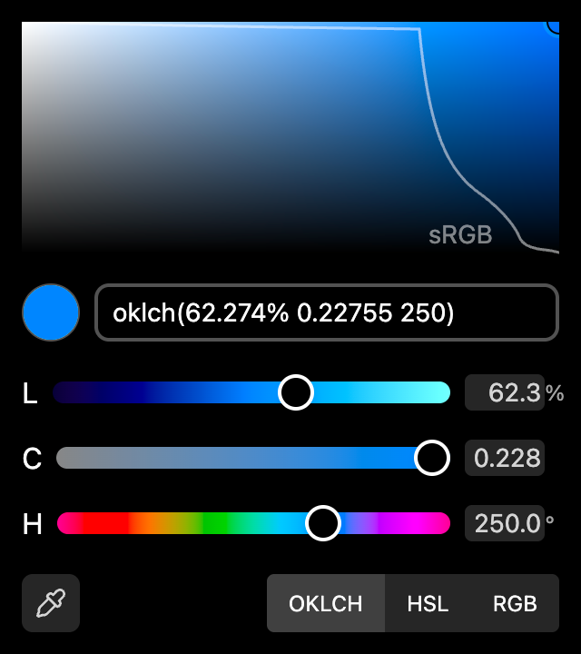
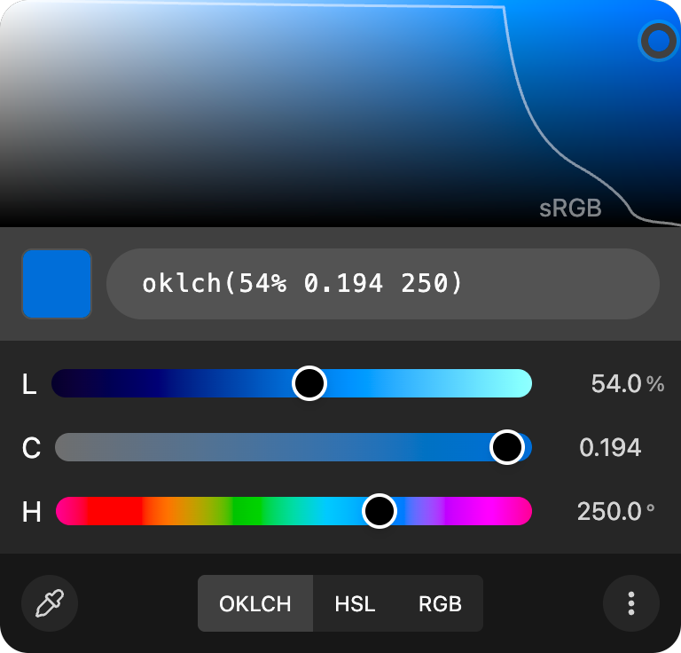

# Color Picker

 [](https://github.com/transience/color-picker/actions/workflows/ci.yml) [](https://sonarcloud.io/summary/new_code?id=transience_color-picker) [](https://sonarcloud.io/summary/new_code?id=transience_color-picker)

A modern, OKLCH-first React/Tailwind color picker.

- 🎨 **OKLCH-first**: Native OKLCH 2D panel with P3 gamut awareness.
- 🌈 **Multi-mode**: Switch between OKLCH, HSL, and RGB color spaces.
- 🎯 **Slot styling**: Every internal element accepts className overrides via a typed `classNames` map.
- 🚨 **Gamut-aware**: Warns when an OKLCH color falls outside the sRGB gamut.

<div style="display: flex; justify-content: center; gap: 10px;">
	<div style="display:flex; flex-direction:column; align-items: center; gap:5px;">
    
    The default layout
	</div>
	<div style="display:flex; flex-direction:column; align-items: center; gap:5px;">
    
    Custom layout
	</div>
</div>

👉 **[Live demo (Storybook)](https://transience.github.io/color-picker/)**

## Setup

```bash
npm i @transience/color-picker
```

Styled with Tailwind CSS utilities — no stylesheet ships.\
Your app's Tailwind build must scan the package's compiled source so the utilities are included in the generated CSS.

**Tailwind v4** (CSS-first):

```css
@import "tailwindcss";
@source "../node_modules/@transience/color-picker/dist";
```

**Tailwind v3** (`tailwind.config.js`):

```js
/** @type {import('tailwindcss').Config} */
export default {
  content: [
    './src/**/*.{js,jsx,ts,tsx}',
    './node_modules/@transience/color-picker/dist/**/*.{js,cjs}',
  ],
  theme: { extend: {} },
  plugins: [],
};
```

## Usage

```tsx
import { ColorPicker } from '@transience/color-picker';
import { useState } from 'react';

export function Example() {
  const [color, setColor] = useState('oklch(0.7 0.15 250)');

  return <ColorPicker color={color} onChange={setColor} />;
}
```

`color` accepts any CSS color string (`#ff0044`, `rgb(...)`, `hsl(...)`, `oklch(...)`, named colors, etc.) — parsed via `colorizr`.

See the [Storybook demo](https://transience.github.io/color-picker/) for layout variants and every prop combination.

## Props

| Prop                                                                                                                         | Type | Default |
|------------------------------------------------------------------------------------------------------------------------------| --- | --- |
| **channels**<br />Per-channel overrides: `label`, `hidden`, `disabled`.<br />Keys irrelevant to the active mode are ignored. | `ChannelsConfig` | — |
| **classNames**<br />Slot-based className overrides for every internal part. See [Styling](#styling).                         | `ColorPickerClassNames` | — |
| **color**<br />Controlled color value. Any CSS color string.<br />Falls back to the internal default when `undefined`.       | `string` | `'oklch(54% 0.194 250)'` |
| **defaultMode**<br />Initial mode for the 2D panel and channel controls.                                                     | `'oklch' \| 'hsl' \| 'rgb'` | `'oklch'` |
| **displayFormat**<br />Initial text format for the `ColorInput`. `'auto'` → `'oklch'` in OKLCH mode, else `'hex'`.           | `ColorFormat` | `'auto'` |
| **modes**<br />Modes shown in the mode switcher.                                                                             | `ColorMode[]` | `['oklch', 'hsl', 'rgb']` |
| **onChange**<br />Called on every color change. Format follows the resolved `outputFormat`.                                  | `(value: string) => void` | — |
| **onChangeMode**<br />Called when the user flips the mode via the switcher.                                                  | `(mode: ColorMode) => void` | — |
| **outputFormat**<br />Initial format `onChange` emits. `'auto'` follows the resolved `displayFormat`.                        | `ColorFormat` | `'auto'` |
| **precision**<br />Decimal digits for non-hex output. Ignored for `hex`.                                                     | `number` | `5` |
| **showAlpha**<br />Renders an alpha slider and appends alpha to emitted values when `< 1`.                                   | `boolean` | `false` |
| **showColorInput**<br />Shows the text color input with the current value formatted per `displayFormat`.                     | `boolean` | `true` |
| **showEyeDropper**<br />Adds a screen color picker button. Silently omitted in browsers without `window.EyeDropper` (currently Chromium-only). | `boolean` | `true` |
| **showHueBar**<br />Shows the rainbow hue bar in the toolbar.                                                                | `boolean` | `false` |
| **showInputs**<br />Shows numeric input fields per channel. Inline when `showSliders` is on, standalone row otherwise.       | `boolean` | `true` |
| **showModeSelector**<br />Shows the OKLCH/HSL/RGB mode switcher.                                                             | `boolean` | `true` |
| **showPanel**<br />Shows the 2D color panel (saturation/value for HSL/RGB, chroma/lightness for OKLCH).                     | `boolean` | `true` |
| **showSettings**<br />Adds a ⋮ menu to expose display and output format choices to end users.                                | `boolean` | `false` |
| **showSliders**<br />Shows the per-channel sliders matching the active mode (L/C/H, H/S/L, or R/G/B).                        | `boolean` | `true` |
| **showSwatch**<br />Shows the circular color preview next to the color input.                                                | `boolean` | `true` |

## Color modes and formats

- **`ColorMode`** — `'oklch' | 'hsl' | 'rgb'`. Drives the 2D panel, mode switcher, and which channel slider/input set is rendered.
- **`ColorFormat`** — `'auto' | 'hex' | 'hsl' | 'oklab' | 'oklch' | 'rgb'`. Used for both `displayFormat` (text input value) and `outputFormat` (what `onChange` emits).

`'auto'` resolves against the active mode: OKLCH mode → `'oklch'`, otherwise `'hex'`. `outputFormat` defaults to following the resolved `displayFormat`, so the emitted string matches what the user sees unless you set them independently.

When an OKLCH color doesn't fit inside a narrow format (`hex`, `hsl`, `rgb`), a gamut warning icon appears inside the color input.

## Styling

Every overridable part is exposed via the `ColorPickerClassNames` slot map (see `src/types.ts`). Each slot's classes are merged with the component's defaults via `clsx` + `tailwind-merge`, so Tailwind utilities override correctly:

```tsx
<ColorPicker
  color={color}
  onChange={setColor}
  classNames={{
    root: 'border border-neutral-300 rounded-lg',
    swatch: { root: 'ring-2 ring-offset-2' },
    hueSlider: { track: 'h-3' },
    modeSelector: 'text-xs',
  }}
/>
```

## Exports

Individual parts are also exported as standalone widgets — drop a swatch, alpha slider, or mode switcher anywhere in your UI.

| Export             | Purpose                                         |
|--------------------|-------------------------------------------------|
| **ColorPicker**    | The full picker.                                |
| **AlphaSlider**    | Checkerboard-backed alpha slider.               |
| **ChannelInputs** | Per-mode input group (L/C/H, H/S/L, or R/G/B).  |
| **ChannelSliders** | Per-mode slider group (L/C/H, H/S/L, or R/G/B). |
| **ModeSelector**   | OKLCH / HSL / RGB mode switcher.                |
| **Swatch**         | Circular color preview over a checkerboard.     |

Constants (`hslHueGradient`, `oklchHueGradient`) and all types (`ColorMode`, `ColorFormat`, `ChannelsConfig`, `ColorPickerClassNames`, etc.) are also exported.

## Related

- [colorizr](https://github.com/gilbarbara/colorizr) — the color math and conversions powering this picker.

## References

- [css-color-component](https://github.com/argyleink/css-color-component)
- [oklume](https://github.com/ipatovanton/oklume)
- [react-color](https://github.com/uiwjs/react-color)
- Chrome DevTools color picker (built-in reference for UX and features)

## License

MIT
